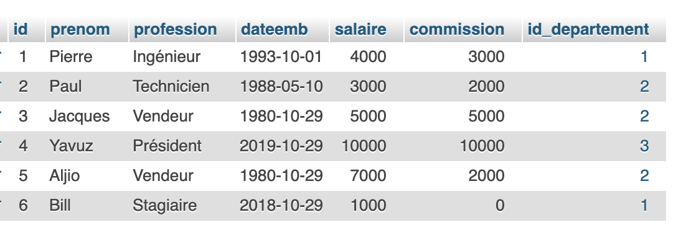
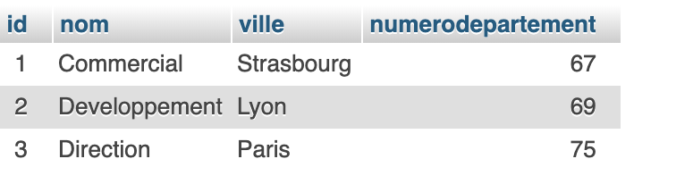

## DOJO SQL ADVANCED
Utiliser les notions de valeur , tris, expressions statistiques en SQL

### Les requetes à faire
* REQ1: Donnez la liste des employés ayant une commision
* REQ2: Donnez les prenoms, professions et salaires des employés par profession croissant, et pour chaque profession, par
salaire décroissant
* REQ3: Donnez le salaire moyen des employés par nom département
* REQ4: Donnez le salaire moyen du département Developpement
* REQ5: Donnez les numéros de département et leur salaire maximum
* REQ6: Donnez les prenoms des employés ayant le salaire maximum dans chaque nom département
* REQ7: Donnez les différentes professions et leur salaire moyen
* REQ8: Donnez le salaire moyen par profession le plus bas

### Importer le fichier SQL

[Fichier SQL](./Dojo_SQLAdvanced.sql)

### Vue des tables

#### Employes

#### Departement
